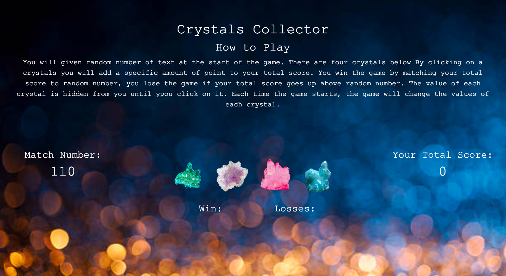

# Crystal-Collector-Game

## Some Useful resources that help me to buid this portfolio
*  Javascript -- Game Logic Code
*  Jquery -- Game Logic Code
*  HTML  -- Show the game output on browser 
*  CSS -- custom display effects of the game
*  Bootstrap -- code optimization

## Description
  How Game works:- 

* There will be four crystals displayed as pokemon buttons on the page.

* The user will be shown a random number at the start of the game.

* When the user clicks on a pokemon, it will add a specific amount of points to the user's total score.

* The user wins if their total score matches the random number from the beginning of the game.

* The user loses if their score goes above the random number.

* The game restarts whenever the user wins or loses.

## Click on the following link to deployed site
[Crystal-Collector-Game](https://minalk24.github.io/Crystal-Collector-Game/)

 ## Images 

## Author
Minal Kharche
